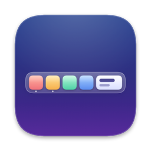
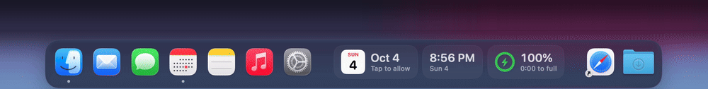
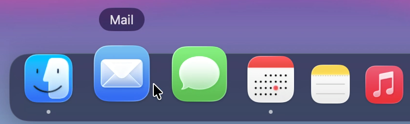
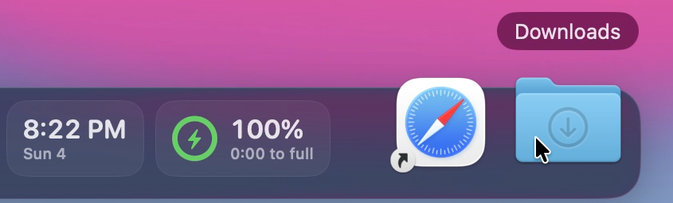
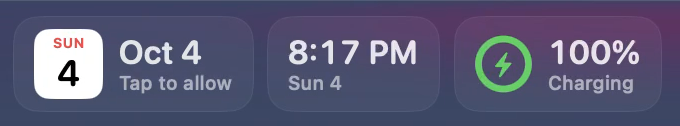

<div align="center">



# OpenDock

**An open-source custom Dock for macOS, with live widgets.**

[](https://github.com/newyorkcompute/opendock/actions/workflows/ci.yml)
[](LICENSE)


[Features](#features) · [Widgets](#widgets) · [Build and run](#build-and-run) ·
[Writing a widget](#writing-a-widget) · [Contributing](#contributing)

</div>

<p align="center">
  <picture>
    <source media="(prefers-reduced-motion: reduce)" srcset="docs/assets/dock-magnification.png">
    
  </picture>
</p>

> [!NOTE]
> OpenDock is an early MVP. It requires macOS 15 or later, and there are no prebuilt
> releases yet, so for now you [build it from source](#build-and-run).

OpenDock is a floating dock panel at the bottom of your screen. It holds apps, folders,
spacers, and small live widgets. It runs as a menu bar app and does not replace or modify
Apple's Dock. You can keep both, or hide Apple's. Inspired by [Dockset](https://dockset.app).

## Features

<table>
  <tr>
    <td width="50%"></td>
    <td width="50%"></td>
  </tr>
  <tr>
    <td>Icons near the pointer grow with a smooth falloff and push their neighbors aside.</td>
    <td>Widgets keep their size and slide out of the way.</td>
  </tr>
</table>

- Floating dock with Liquid Glass on macOS 26, and Frosted or Solid materials as alternatives
- Apps, folders and files, small or regular spacers, and dividers. Click a divider for
  quick settings (hiding, magnification, position), like the Dock's separators
- Running-app indicators, with an option to show running apps that aren't pinned
- Magnification like the Dock's: icons near the pointer grow with a smooth falloff and
  push their neighbors aside, with an adjustable size and a name label above the hovered item
- Auto-hide with a configurable delay
- Drag items in the dock to reorder them, and drop apps or folders from Finder to add them
- Widgets: Clock, Battery, and Calendar
- Settings window with General, Dock Items, Widgets, and About tabs
- Export and import your layout as JSON
- Launch at login
- Menu bar menu for showing and hiding the dock, adding items, and backups

## Widgets

<p align="center">
  
</p>

Widgets are small live tiles that sit in the dock next to your apps. Click one to open a
popover with more detail. Each widget has its own options in Settings > Dock Items.

| Widget | In the dock | Click for | Options |
| --- | --- | --- | --- |
| Calendar | Today's date and your next event | Today's events, with a Join button for meetings that have a link | Show next event |
| Clock | The time, with the date or your own label below | The full date, time zone, and a month calendar | Seconds, date, time zone, label |
| Battery | Charge level and power source | Each battery, including connected accessories, and a shortcut to Battery Settings | Percentage, accessory batteries |

The Calendar widget asks for calendar access when it first appears. Without access it
shows "Tap to allow", and its popover has a button to allow access or open Privacy
Settings. To build your own widget, see [Writing a widget](#writing-a-widget).

## Build and run

Requirements:

- macOS 15 or later to run OpenDock.
- Xcode 26 or later to build it, for Swift 6.2+ and the macOS 26 SDK. A stock Xcode is
  enough; you don't need a separate Swift toolchain. CI builds every change with the newest
  stable Xcode on GitHub's macOS 26 runner (currently Xcode 26.6 with Swift 6.3.3).

```sh
make run
# or
scripts/build-app.sh --debug
open build/OpenDock.app
```

`make release` builds an optimized bundle in `build/OpenDock.app`. `make test` runs the
unit tests.

Notes:

- If the build fails with a license error, run `sudo xcodebuild -license accept`.
- The app is ad-hoc signed. macOS ties privacy permissions to the signature, so the
  Calendar permission prompt shows up again after each rebuild.
- Launch at login only works from the `.app` bundle, not from `swift run`.
- Your layout is stored in `~/Library/Application Support/OpenDock/dock.json`.

## Architecture

OpenDock is a single Swift Package with no Xcode project. `scripts/build-app.sh` wraps the
built binary in a signed `.app` bundle.

| Target | Role |
| --- | --- |
| `DockCore` | Models (`DockItem`, `DockProfile`, `DockSettings`) and JSON persistence (`DockStore`). No UI, fully unit-tested. |
| `DockWidgetKit` | The widget contract (`DockWidget`), the `WidgetRegistry`, shared tile views, and environment values. |
| `SystemServices` | Thin wrappers over macOS APIs: running apps, power sources, EventKit, icons, launching. |
| `Widgets/*` | One target per built-in widget (`ClockWidget`, `BatteryWidget`, `CalendarWidget`). |
| `DockShell` | The dock panel: window, positioning, auto-hide, item views, drag and drop. |
| `OpenDock` (`App/`) | The menu bar app: wires everything together, plus the menu, Settings window, and launch at login. |

UI targets compile with main-actor default isolation under Swift 6 strict concurrency.

## Writing a widget

A widget is a type that conforms to `DockWidget`. The dock stores `WidgetInstance` values
(a type ID plus a `[String: String]` settings bag) and asks the registry to render them.

```swift
import DockCore
import DockWidgetKit
import SwiftUI

public enum HelloWidget: DockWidget {
    public static let typeID = "com.example.widget.hello"   // stable, never change it
    public static let displayName = "Hello"
    public static let systemImage = "hand.wave"
    public static let summary = "Says hello."
    public static let defaultSettings = ["name": "World"]

    public static func makeView(instance: WidgetInstance) -> AnyView {
        AnyView(HelloTile(instance: instance))
    }

    // Optional: makePopout(instance:) for a click-to-open popover and
    // makeSettingsView(instance:) for options in Settings > Dock Items.
}

struct HelloTile: View {
    let instance: WidgetInstance

    var body: some View {
        WidgetTile {
            WidgetPrimaryText("Hello, \(instance.settings["name"] ?? "World")")
        }
    }
}
```

Guidelines:

- Wrap the content in `WidgetTile` and use `WidgetPrimaryText` and `WidgetSecondaryText`
  so the tile scales with the icon-size setting (`\.dockIconSize`).
- Pause polling when `\.dockIsVisible` is false.
- Save settings through `\.widgetUpdateSettings`, never through your own files.

Then add a target under `Sources/Widgets/` in `Package.swift`, add it as a dependency of
`OpenDock`, and register it in `AppDelegate` with `registry.register([...])`.

## Roadmap

Tracked as [GitHub issues](https://github.com/newyorkcompute/opendock/issues); the ones
labeled `good first issue` are self-contained. Highlights:

- Profiles, with switching by hotkey or Focus mode
- More widgets: Now Playing, Weather, Reminders, System Activity, Network, Timer, Sticky
  Note, Stocks
- Left and right screen edges
- Notification badges
- Minimized windows in the dock
- Automatic updates with Sparkle
- Homebrew cask

## Contributing

Issues and pull requests are welcome. Please keep changes focused, match the existing
style, and run `swift build` and `swift test` before opening a PR. New widgets are a
great place to start. See [CONTRIBUTING.md](CONTRIBUTING.md) for the conventions and how
to test, and the [Code of Conduct](CODE_OF_CONDUCT.md). Report security issues as described
in [SECURITY.md](SECURITY.md).

## License

MIT. See [LICENSE](LICENSE).
